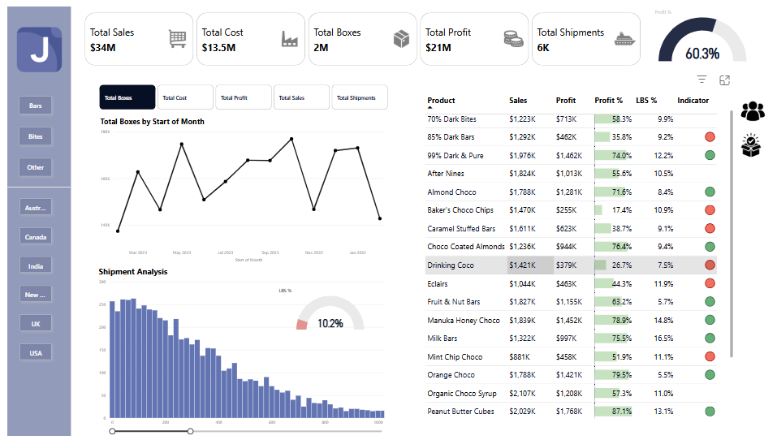

# Sales Performance Analysis Dashboard - Power BI 

This project allowed me to dive deep into data modeling (using star schema), DAX measures (including time intelligence for MoM analysis), and advanced visualization techniques like dynamic trend charts with field parameters and interactive tooltips. 

# Key Skills Learned

* Dashboard Design – Clean, interactive visuals.
* Data Modeling – Star schema development for efficiency.
* KPIs & Measures – Identified and created key performance indicators.
* DAX Measures – Dynamic calculations and time intelligence (MoM).
* Dynamic Visuals – Field parameters for trend analysis.
* Advanced Features – Bookmarks, slicer panels, tooltips, and conditional formatting.
* Custom Visuals – Gauge charts, histograms, and Zoom Slider integration.

# Check it out here

* Live Dashboard: !App PowerBi Link(https://bit.ly/3Pee209)

Thank You! 
